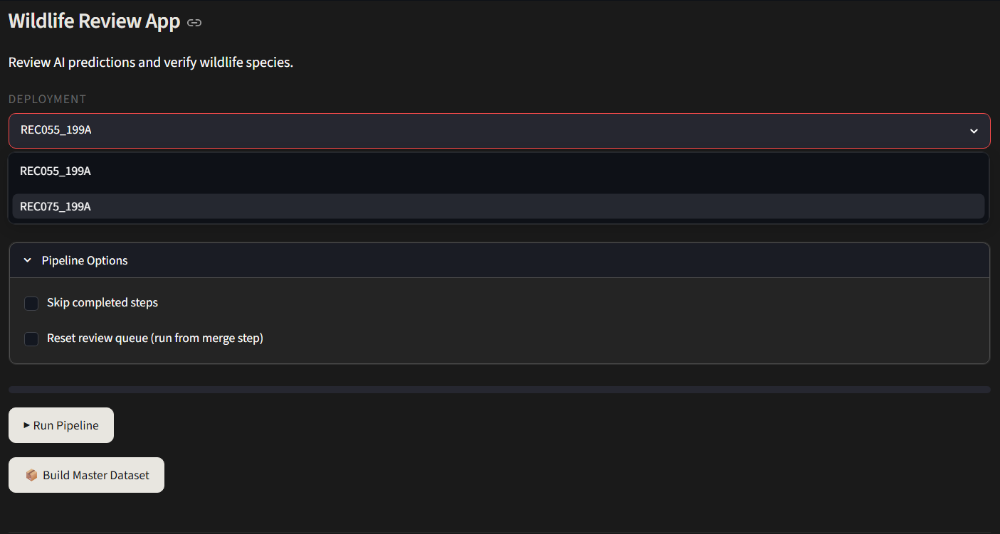
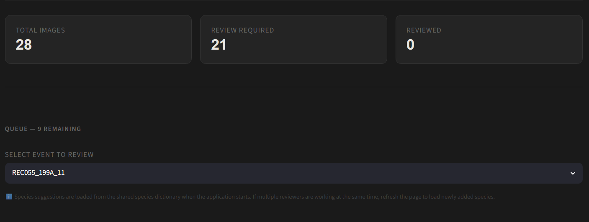
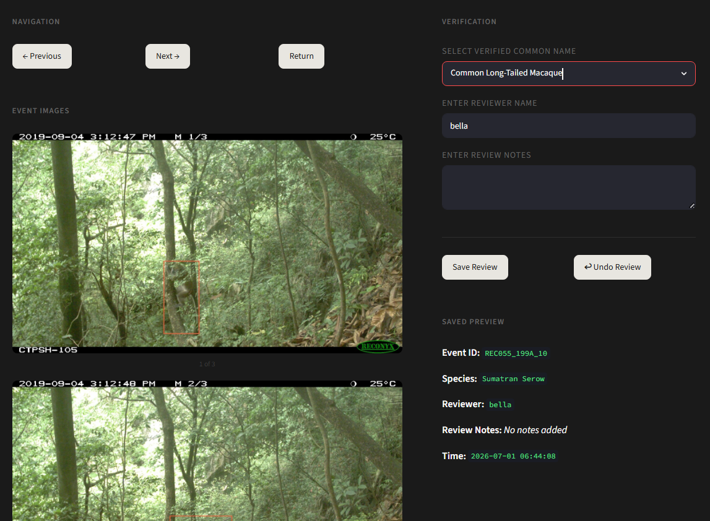
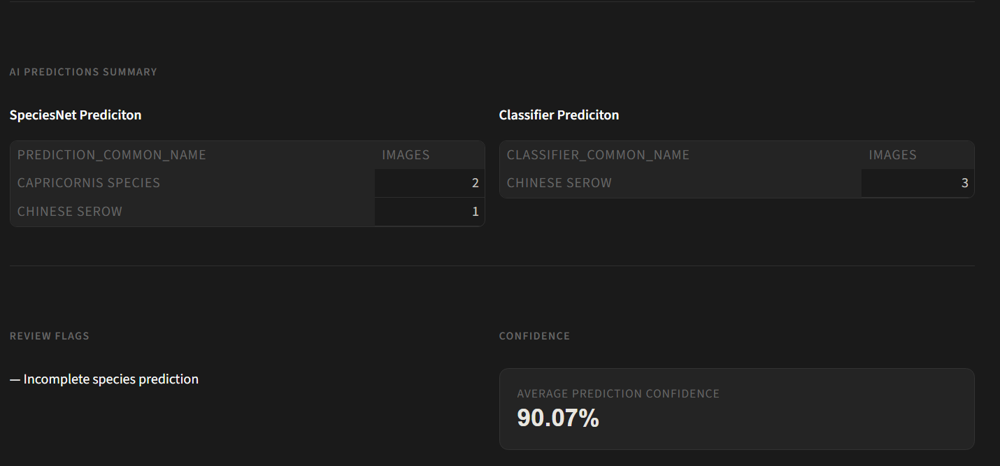

# Wildlife Monitoring Pipeline


An AI-assisted end-to-end wildlife monitoring system that transforms camera trap images into a structured and review-ready ecological dataset.

---

## Project Overview

This system processes wildlife camera trap images through:

- AI detection (MegaDetector)
- Species classification (SpeciesNet)
- Human verification system
- Multi-deployment dataset management
- Master + Clean dataset generation
- Analytics-ready ecological data pipeline

It is designed for **scalable biodiversity monitoring across multiple locations and experiments**.

---

## App Preview

### Deployment and Pipeline Runner


### Folder Information and Event Queue


### Review Interface


### AI Prediction Information


--- 

# System Architecture

The system is built in **three main layers**:

---

## 1. Deployment Layer (Experiment Level → Future Batch-Based System)

Each deployment is an independent processing unit.

### Features:
- Raw image processing
- Detection + classification pipeline
- Review system (human-in-the-loop)
- Logs, backups, and session state

### Structure:
```text
deployments/
├── deployment_01/
├── deployment_02/
├── deployment_03/

```

Each deployment is fully independent and reproducible.

---

## 2. Master Dataset Layer (Aggregation Layer)

All deployments are merged into a single dataset:

### Responsibilities:
- Combine all deployment outputs
- Standardize schema across runs
- Add deployment metadata
- Ensure cross-experiment consistency

### Output:
- master_dataset_raw.csv

---

## 3. Clean Dataset Layer (Final Intelligence Layer)

Final curated dataset for analytics and dashboards.

### Responsibilities:
- Taxonomy normalization
- Species name standardization
- Review reconciliation
- Duplicate handling
- Final truth dataset generation

### Output:
- clean_dataset.csv

---

# System Pipeline Flow

```text
Camera Trap Images
        ↓
script01_audit.py
        ↓
script02_run_megadetector.py
        ↓
script03_build_detection.py
        ↓
script04_run_speciesnet.py
        ↓
script05_merge_species_results.py
        ↓
script06_build_review_queue.py
        ↓
wildlife_monitor.py (Review UI)
        ↓
script08_backup_manager.py
        ↓
script09_build_master_dataset.py
        ↓
Clean Dataset Generation
```

---

# Project Structure

```text
config/
├── deployment.py
├── paths.py

app/
├── wildlife_monitor.py   # Streamlit Review Interface

scripts/
├── script01_audit.py
├── script02_run_megadetector.py
├── script03_build_detection.py
├── script04_run_speciesnet.py
├── script05_merge_species_results.py
├── script06_build_review_queue.py
├── script08_backup_manager.py
├── script09_build_master_dataset.py
├── species_lookup.py        ⭐ (in progress)
├── pipeline_runner.py

```

---

## AI Pipeline Workflow

### 1. Data Audit  
   - Validate raw camera trap images and metadata  

### 2. Object Detection (MegaDetector)  
   - Detect animals, humans, and empty frames  
   - Filter relevant wildlife images  

### 3. Detection Dataset Building  
   - Convert detection outputs into structured tables  
   - Standardize event-based dataset (event_id)

### 4. Species Classification (SpeciesNet)  
   - Predict species from detected animals  
   - Generate confidence scores  
   - Flag low-confidence predictions for review

### 5. Data Integration  
   - Merge detection + classification results  
   - Extract taxonomy hierarchy (class → species)  
   - Build unified dataset with taxonomy-ready structure

### 6. Processed Dataset Creation  
   - Identify cases requiring human verification:
      - unknown species
      - low confidence predictions
      - conflicting AI outputs 

### 7. Human-in-the-loop Review System 
   - Streamlit-based review interface
   - Features:
         - species verification dropdown
         - “Other…” dynamic species input
         - event-based navigation 

### 8. Review Logging + Undo System 
   - Full action tracking:
      - original prediction
      - user correction
      - timestamp + event ID
   - Undo system for safe rollback of changes

### 9. Master Dataset Builder 
   - Aggregates all reviewed and processed data
   - Produces final structured dataset for analytics

### 10. Clean Dataset Output  
   - Final analysis-ready dataset for research and dashboards

---

## Final Output Dataset

### Image Metadata
- image_path
- file_name
- folder_name
- capture_datetime
- temperature_c
- moon_phase
- event_number
- sequence

### AI Predictions
- prediction_class
- prediction_species
- prediction_common_name
- prediction_score

### Classifier Output
- classifier_species
- classifier_common_name
- classifier_score

### Taxonomy
- class
- order
- family
- genus
- species
- common name

### Human Review Layer
- review_status
- review_required
- verified_common_name
- reviewer
- review_notes
- review_timestamp

---

## Technologies Used

- Python
- pandas
- MegaDetector
- SpeciesNet
- JSON processing
- Data pipeline engineering

---

## Key Features

- End-to-end AI wildlife processing pipeline
- Camera trap image automation
- Species classification + taxonomy extraction
- Human-in-the-loop review system
- Structured final dataset for analytics

---

## Current Development Status

Completed Core System:
- AI detection pipeline
- Species classification pipeline
- Review system (Streamlit UI)
- Undo + backup system
- Review logging system
- Multi-deployment support

In Progress:
- script09_build_master_dataset.py
- species_lookup.py (taxonomy enrichment system)

Next Phase (Intelligence Layer): 
- Merge other data of the camera site
   - coordinates
   - habitat type
   - environment 

- Analytics Dashboard
   Deployment comparison
   Species distribution analysis
   Confidence scoring trends
   Review performance metrics

- Admin Panel
   Species dictionary management
   Backup management system
   Review logs explorer
   System monitoring

---

## Author Note

This project was built as a self-driven exploration of **AI + environmental data systems**, combining computer vision, data engineering, and ecological workflows into a unified pipeline.

---

## Future Vision

A fully automated wildlife intelligence system:

> From forest camera → to real-time biodiversity insights