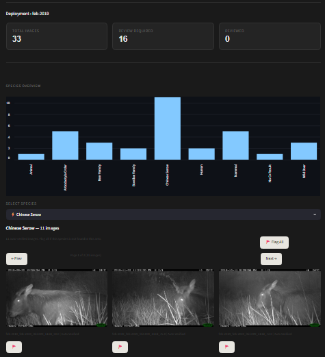
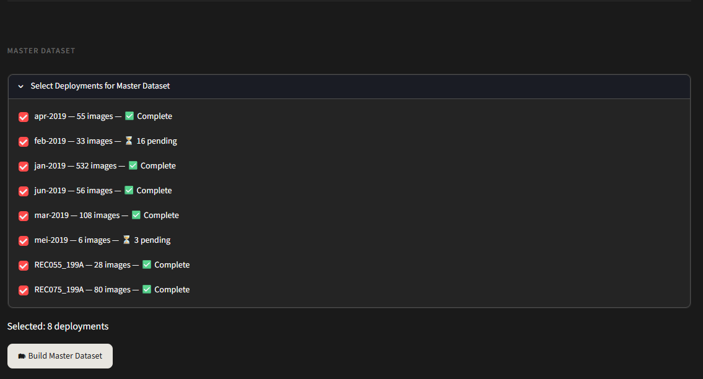

# Wildlife Monitoring Pipeline


An AI-assisted end-to-end wildlife monitoring system that transforms camera trap images into a structured, review-ready, and analytics-ready ecological dataset.

Built on real fieldwork data of **~86,000 camera trap images** collected over **187 days across 4 sites** at Mount Khantan, Perak, Malaysia.

---

## Project Overview

This project combines **computer vision**, **data engineering**, and **human-in-the-loop verification** into a single workflow for wildlife monitoring.

The system automatically:

- Detects wildlife using **MegaDetector**
- Identifies species using **SpeciesNet**
- Builds a structured wildlife dataset
- Automatically enriches taxonomy information
- Flags uncertain predictions for manual verification
- Provides an interactive Streamlit review interface
- Generates deployment-level and master datasets ready for ecological analysis

Designed for scalable biodiversity monitoring across multiple camera trap deployments.

---

## App Preview

### Deployment Manager
_Select deployment and run the AI pipeline._


---

### Species Overview
_Per-deployment species distribution with image gallery and bulk re-review tools._



---

### Review Interface
_Event-based review with AI predictions, taxonomy information, and manual verification._


---

### AI Prediction Information
_Bounding boxes, prediction confidence, taxonomy, and metadata._


---

### Master Dataset Builder
_View processing deployment, choose dataset to combine._



---

# System Architecture

The system is built in **three main layers**:

---

## 1. Deployment Layer (Per-Experiment Processing)

Each deployment is an independent, reproducible processing unit.

### Features

- Camera trap image management
- AI processing pipeline
- Human review interface
- Independent outputs
- Independent review logs
- Independent backups

Example:

```text
deployments/
├── apr-2019/
├── mei-2019/
├── jun-2019/
├── jul-2019/
```

---

## 2. Analytics Layer

The cleaned dataset is designed for downstream analysis.

Future dashboards include:

- Species distribution
- Camera performance
- Deployment comparison
- Review statistics
- Ecological summaries

---

## 3. Master Dataset Layer

Reviewed deployments are combined into one standardized dataset.

Responsibilities:

- Merge deployments
- Preserve deployment metadata
- Standardize schema
- Prepare for dashboarding

Output:

```
master_dataset.csv
```

---

# AI Pipeline

The current automated pipeline consists of **three processing stages**.

```text
Camera Trap Images
        │
        ▼
script01_run_megadetector.py
(Object Detection)
        │
        ▼
script02_run_speciesnet.py
(Classify Detection)
        │
        ▼
script03_build_wildlife_dataset.py
(Build Detection Dataset
+ SpeciesNet Merge
+ Taxonomy Enrichment
+ Review Queue)
        │
        ▼
species_lookup.py
(Auto Taxonomy Lookup)
        │
        ▼
Wildlife Review App
(Streamlit)
        │
        ▼
Master Dataset Builder
        │
        ▼
Clean Dataset
```

---

# Streamlit Review Application

The review interface is the central component of the project.

## Deployment Manager

- Select deployment
- View image count
- Estimated processing time based on previous runs
- Run pipeline
- Reset review queue
- Skip completed processing

---

## Review Queue

Displays only events requiring verification.

Features include:

- Event-based navigation
- Bounding box overlay
- AI prediction
- Classifier prediction
- Taxonomy information
- Camera metadata
- Review history

---

## Human Review

Users can:

- Verify AI prediction
- Correct species
- Add custom species
- Add review notes
- Undo previous actions

Every review updates:

- Review status
- Reviewer
- Timestamp
- Species taxonomy

---

## Species Overview

Each deployment includes a live species summary.

Features:

- Species frequency bar chart
- Image gallery by species
- Auto-verified species indicator
- Bulk "Flag All" for re-review
- Individual image flagging
- Pagination for large datasets

This provides a quick overview of wildlife detected within a deployment before detailed review.

---

# Review Workflow

```text
MegaDetector
        │
SpeciesNet
        │
        ▼
Prediction Accepted?
        │
 ┌──────┴──────┐
 │             │
Auto Verified  Needs Review
 │             │
Quick         Human
review      Verification
 │             │
 └──────┬──────┘
        │
Verified Dataset
```

Review statuses:

- Auto Verified
- Pending
- Verified

---

# Project Structure

```text
config/
├── deployment.py              — Deployment configuration
└── paths.py                   — Path management

app/
└── wildlife_monitor.py        — Streamlit review interface (main UI)

scripts/
├── pipeline_runner.py         — Central pipeline execution controller
├── script01_run_megadetector.py
├── script02_run_speciesnet.py
├── script03_build_wildlife_dataset.py
├── script04_build_dictionary.py
├── script05_backup_manager.py
└── script06_build_master_dataset.py

utils/
├── audit.py
├── pipeline_status.py
└── species_lookup.py          — Taxonomy enrichment

outputs/
├── deployments/
├── master/
└── logs/

```

---

# Final Output Dataset

### Image Metadata
- `image_path`, `file_name`, `folder_name`
- `capture_datetime`, `temperature_c`, `moon_phase`
- `event_number`, `sequence`

### AI Predictions
- `prediction_class`, `prediction_species`, `prediction_common_name`, `prediction_score`

### Classifier Output
- `classifier_species`, `classifier_common_name`, `classifier_score`

### Taxonomy
- `class`, `order`, `family`, `genus`, `species`, `scientific_name`,`common_name`

### Human Review Layer
- `review_status` (Pending / Verified / Corrected / Skipped)
- `review_required`, `verified_common_name`
- `reviewer`, `review_notes`, `review_timestamp`

---

# Technologies Used

| Category | Tools |
|---|---|
| Language | Python 3.10+ |
| Data Processing | Pandas, JSON |
| AI Models | MegaDetector (object detection), SpeciesNet (species classification) |
| Review Interface | Streamlit |
| Pipeline Orchestration | pipeline_runner.py (modular script controller) |
| Data Engineering | ETL pipeline, session state management, audit logging |

---

# Current Development Status

```
████████████████████░  95%
```

### Completed
- Data audit layer
- MegaDetector detection pipeline
- SpeciesNet classification pipeline
- Detection dataset builder
- Merge results layer
- Review queue system
- Species enrichment (species_lookup.py) taxonomy auto-fill
- Streamlit review interface
- Undo system (session-based snapshot rollback)
- Backup system (per-session dataset + log backup)
- Review log system (full audit trail)
- Pipeline runner (central execution controller)
- Session state management
- Dynamic species dictionary (auto-growing)
- Multi-deployment support
- Master dataset builder (script09)
- Clean dataset generation

### Next Phase — Intelligence Layer
**Dashboard** (Power BI / Python):
- Overall statistics
- Deployment summary
- Species distribution analysis
- Confidence scoring trends
- Review performance metrics

### GIS Integration

- Camera locations
- Habitat visualization
- Spatial analysis
- Species distribution mapping

---

## Author Note

This project was built as a self-driven exploration of **AI + environmental data systems**, combining computer vision, data engineering, and ecological fieldwork into a unified analytics pipeline.

The dataset is real — collected during conservation biology fieldwork at **Mount Khantan, Perak, Malaysia** over 187 days across 4 camera trap sites.

---

## Future Vision

A fully automated wildlife intelligence system:

> From forest camera → to real-time biodiversity insights